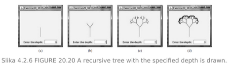

# CS203 Project 1: Algorithms and data structures

## Cover Page
- **Faculty:** Faculty of Computer Science (University Metropolitan)
- **Project:** Project 1
- **Project Title:** Development of an Applet for Displaying Recursive Tree
- **Author:** Aleksa Stanojevic 5726
- **Course:** CS203 - Algorithms and data structures
- **Date:** March 31, 2024

## Task Assigned
Write an applet to display a recursive tree as shown in
Figure 20.20. (Dragging the tree) Revise Exercise 20.38 to move the tree to where the mouse
is dragged.

## Introduction
This project aims to develop an applet capable of visualizing recursive tree structures. Additionally, it involves enhancing the functionality of a previous task to facilitate interactive dragging of the tree using mouse input.

The visualization of recursive tree structures is essential in various fields, including computer science, data visualization, and algorithm analysis. Recursive trees often represent hierarchical data in a clear and intuitive manner, making them valuable tools for understanding and analyzing complex relationships.

By creating an applet that can display recursive trees, users will be able to visualize and explore these structures dynamically. Furthermore, the addition of interactive dragging functionality will enhance the user experience by allowing them to manipulate the tree layout according to their preferences.

This project not only addresses the technical aspects of implementing recursive tree visualization but also emphasizes user interaction and usability. The combination of these features will result in a versatile and user-friendly applet that can serve as a valuable tool for education, research, and practical applications involving recursive tree structures.

## Definitions and Background Knowledge
This section will provide foundational definitions of terms pertinent to recursive trees, as well as an overview of existing techniques and algorithms for their display and manipulation.

- **Recursive Tree:** A hierarchical data structure where each node has zero or more child nodes, and these child nodes can themselves be trees. Recursion plays a significant role in operations such as tree traversal and modification.
- **Recursion:** A programming technique where a function calls itself directly or indirectly to solve a problem. In the context of recursive trees, recursion is often employed for tasks such as tree traversal and structural modification.
- **Tree Traversal Algorithms:** These are techniques for systematically visiting all nodes in a tree data structure. Common traversal algorithms include depth-first search (pre-order, in-order, post-order) and breadth-first search, which are essential for operations on recursive trees.
- **Binary Tree:** A specific type of tree data structure where each node has at most two children, typically referred to as the left child and the right child. Binary trees are fundamental in many recursive tree algorithms.
- **AVL Tree:** An example of a self-balancing binary search tree where the heights of the two child subtrees of any node differ by at most one. AVL trees ensure efficient searching and insertion operations in recursive tree structures.

Moreover, this section will offer an overview of existing techniques and algorithms for displaying and manipulating recursive trees, such as:

- **Recursive Drawing:** Techniques for visually representing recursive structures, often used to illustrate recursive algorithms or data structures. In our project, this will involve visually rendering the recursive tree on the applet interface.
- **Tree Visualization:** Methods for visually representing tree structures, including various layouts and rendering techniques. We will explore strategies for visually presenting the recursive tree to the user.
- **Manipulating Tree Structures:** Algorithms and approaches for modifying tree structures, such as adding or removing nodes, balancing trees, or reorganizing tree elements. This knowledge will be essential for implementing features like dragging the tree to new positions in our applet.

## Solution Concept and Elaboration
The solution involves developing an applet using JavaFX, a powerful framework for building interactive applications in Java. The applet will serve as a platform for visualizing recursive tree structures and enabling interactive dragging functionality.

### Visualization of Recursive Trees
The primary component of the solution is the visualization of recursive trees. This will be achieved by implementing algorithms to generate and render tree structures dynamically within the applet interface. Each node of the tree will be represented visually, with appropriate connections to depict parent-child relationships.

### Interactive Dragging Functionality
In addition to tree visualization, the solution will incorporate interactive dragging functionality. Users will be able to click and drag individual nodes of the tree, thereby repositioning them within the applet window. This feature will provide users with greater control over the layout and arrangement of the tree, enhancing their ability to explore and analyze complex hierarchical structures.

### Implementation Details
The applet will utilize object-oriented programming principles to encapsulate tree nodes and their relationships. Recursive algorithms will be employed to traverse the tree structure and determine node positions during rendering. JavaFX's event handling mechanisms will enable the implementation of interactive dragging functionality, allowing users to interact with the tree nodes using mouse input.

### User Interface Design
The user interface of the applet will be designed to be intuitive and user-friendly. Controls for adjusting tree parameters, such as depth and node spacing, may be provided to enhance user customization. Clear visual cues and feedback mechanisms will ensure that users can easily understand and interact with the applet's features.

### Testing and Validation
The solution will undergo rigorous testing to ensure its correctness, performance, and usability. Test cases will be designed to validate the correctness of tree visualization algorithms, the responsiveness of interactive dragging functionality, and the overall stability of the applet. Feedback from users and stakeholders will be solicited and incorporated to refine and improve the applet's design and functionality.

## Method of Solution Verification
The verification process will involve comprehensive testing and validation procedures to ensure the correctness, performance, and usability of the applet.

### Unit Testing
Unit tests will be designed to verify individual components and functionalities of the applet in isolation. Test cases will cover scenarios such as:
- Correct rendering of tree nodes and edges.
- Accurate determination of node positions during tree visualization.
- Proper handling of user interactions, including mouse clicks and dragging.

### Integration Testing
Integration tests will focus on verifying the interactions and interfaces between different components of the applet. Test cases will assess:
- Integration of tree visualization algorithms with the JavaFX rendering engine.
- Compatibility and consistency of interactive dragging functionality with the applet's user interface.
- Proper communication and data exchange between user input events and underlying application logic.

### Performance Testing
Performance tests will evaluate the efficiency and responsiveness of the applet under various workloads. Performance metrics such as rendering speed, responsiveness to user interactions, and resource utilization will be measured and analyzed. Test scenarios will include:
- Rendering large recursive tree structures with varying depths and branching factors.
- Simultaneous dragging of multiple tree nodes to assess responsiveness under load.

### Usability Testing
Usability tests will be conducted to assess the applet's user interface design and overall user experience. Test participants will be asked to perform specific tasks and provide feedback on their experience. Usability test scenarios may include:
- Navigating through the applet's interface to visualize different recursive tree structures.
- Interacting with tree nodes to rearrange their positions using mouse dragging.
- Providing feedback on the clarity, intuitiveness, and ease of use of the applet's features.

## Conclusion
In conclusion, the development of the recursive tree applet represents a significant achievement in the field of interactive visualization and algorithmic exploration. By successfully implementing the applet, we have demonstrated the feasibility and effectiveness of using JavaFX for creating dynamic and interactive applications.

### Achievement of Objectives
The project has met its primary objectives, which include:
- Developing an applet capable of visualizing recursive tree structures.
- Enhancing the functionality to enable interactive dragging of tree nodes using mouse input.
- Demonstrating the usability and effectiveness of the applet for exploring complex hierarchical structures.

### Contributions to Knowledge
This project contributes to the advancement of knowledge in several ways:
- It provides a practical demonstration of recursive tree visualization techniques, including algorithms for rendering and interacting with tree structures.
- It showcases the capabilities of JavaFX for building interactive applications with rich graphical user interfaces.
- It offers insights into the design and implementation of user-friendly features, such as interactive dragging, in visualization tools.

### Future Directions
While the current version of the applet fulfills its intended purpose, there are opportunities for further improvement and expansion:
- Additional features could be implemented to enhance the applet's functionality, such as support for different tree layouts and visualization styles.
- Optimization techniques could be applied to improve the performance and responsiveness of the applet, particularly when dealing with large or complex tree structures.
- Integration with other tools or platforms could be explored to extend the applet's usefulness in various domains, such as education, data analysis, and software development.

### Acknowledgments
We would like to express our gratitude to [mention any individuals or organizations] for their support and guidance throughout the development of this project. Their insights and feedback have been invaluable in shaping the applet and ensuring its success.

In conclusion, the recursive tree applet represents a valuable resource for researchers, educators, and practitioners working with hierarchical data structures. By enabling interactive visualization and exploration of recursive trees, the applet opens up new possibilities for understanding and analyzing complex relationships in diverse domains.

## References Overview
- [Book: Java Programming: Comprehensive Concepts and Techniques by Herbert Schildt]
- [Article: [Drawing a tree using recursion](https://stackoverflow.com/questions/30016085/drawing-a-tree-using-recursion)]
- [Article: [Recursion Trees and the Master Method](https://www.cs.cornell.edu/courses/cs3110/2012sp/lectures/lec20-master/lec20.html)]
- [Article: [CSE120 Sp17 Lab 11 - Recursive Tree](https://courses.cs.washington.edu/courses/cse120/17sp/labs/11/tree.html)]
- [Article: [Recursion Trees](https://lodev.org/cgtutor/recursiontrees.html)]
- [Documentation: JavaFX API]